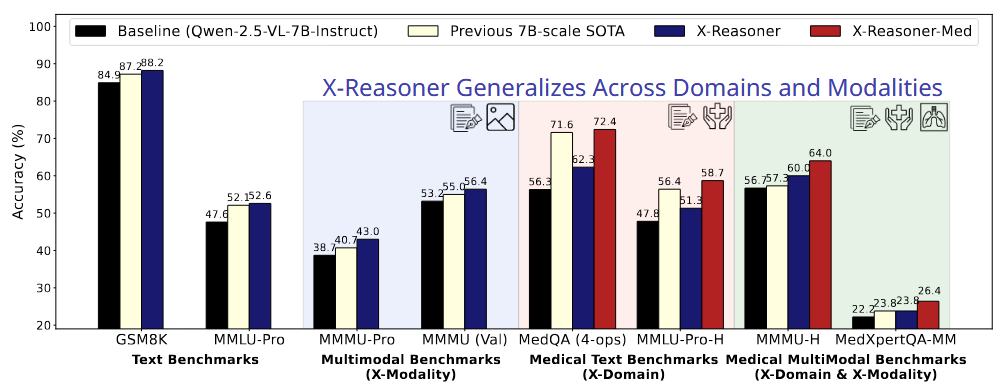
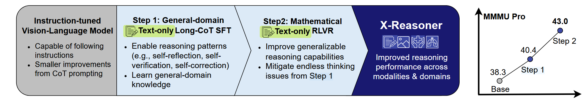

<div align="center">
  <h1>X-Reasoner: Towards Generalizable Reasoning Across Modalities and Domains</h1>
  <p>A training recipe that optimizes the reasoning capability of VLMs with SFT and RL on general-domain text-only data.
 </p>
 <a href="https://arxiv.org/abs/2505.03981"><b>Paper Arxiv Link </b>👁️</a>
</div>
<br>


## News

- May 6, 2025: Our paper is released on arxiv: [arxiv link](https://arxiv.org/abs/2505.03981)
- (We will release the models soon.)

## Results



Experiments show that X-Reasoner successfully transfers reasoning capabilities to both multimodal and out-of-domain settings, outperforming existing state-of-the-art models trained with in-domain and multimodal data across various general and medical benchmarks

## Method



X‑Reasoner is built with a *two‑stage, text‑only post‑training pipeline* that adds robust reasoning skills to a vision‑language model (VLM) and lets those skills generalize across both modalities and domains.

### Step 1: Supervised fine‑tuning (SFT) with long chains‑of‑thought

* **Starting point** We begin with the instruction‑tuned `Qwen‑2.5‑VL‑7B‑Instruct` checkpoint, which already follows prompts but lacks explicit reasoning ability.
* **Data** We fine‑tune on *OpenThoughts‑114k*, a 114 k‑example dataset of math, coding, and science questions whose *long* chain‑of‑thought (CoT) rationales were distilled from the stronger DeepSeek‑R1 model. Link: [open-thoughts](https://github.com/open-thoughts/open-thoughts)
* **Algorithm** We train the model with SFT for 4 epochs.

### Step 2: Reinforcement learning with verifiable rewards (RLVR)
* **Why RL?** SFT yields structured reasoning but can over‑explain and drift; RL trims length and sharpens correctness.
* **Data** We use *Orz‑Math‑57k*, a curated math dataset for RLVR from [Open Reasonder Zero](https://github.com/Open-Reasoner-Zero/Open-Reasoner-Zero).
* **Algorithm** We adopt *Group‑Relative Policy Optimisation (GRPO)*, a PPO‑style update that compares multiple sampled answers per query.  Outcome supervision is applied with *exact answer correctness* (1 / 0).

### Domain‑specific extension: X‑Reasoner‑Med

To demonstrate that X-Reasoner serves as a strong foundation for domain specialization, we further train it on the MedQA dataset using the same SFT → RLVR recipe.
The resulting **X‑Reasoner‑Med** sets new 7B‑scale state‑of‑the‑art scores on a suite of textual and image‑based medical‑reasoning tasks.

### Key design choices

* **Pure textual supervision** All optimisation steps use only text; the frozen vision encoder still benefits from better language‑side reasoning.
* **General-domain supervision** We leverage general-domain data to promote cross-domain generalization and to initialize domain-specialization. 
* **Long CoT + verifiable RL** SFT teaches rich, step‑by‑step reasoning; RLVR then rewards final‑answer accuracy, delivering strong, robust gains.
  

## References

The codebase for SFT is a fork [Llama Cookbook](https://github.com/meta-llama/llama-cookbook) (we forked it when it was named `llama-recpies`).
This codebase for RL is a fork of the [veRL](https://github.com/volcengine/verl) project with the support for vision language models.
We thank all the authors for providing such a high-performance SFT and RL training framework.

## Citation

```
@misc{liu2025xreasonergeneralizablereasoningmodalities,
      title={X-Reasoner: Towards Generalizable Reasoning Across Modalities and Domains}, 
      author={Qianchu Liu and Sheng Zhang and Guanghui Qin and Timothy Ossowski and Yu Gu and Ying Jin and Sid Kiblawi and Sam Preston and Mu Wei and Paul Vozila and Tristan Naumann and Hoifung Poon},
      year={2025},
      eprint={2505.03981},
      archivePrefix={arXiv},
      primaryClass={cs.CL},
      url={https://arxiv.org/abs/2505.03981}
}
```
